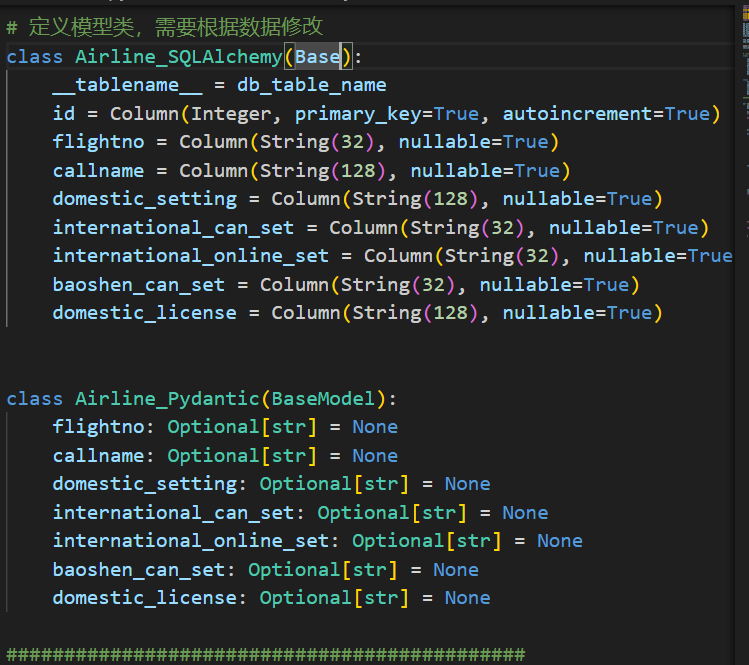

## 介绍
AWS [开源知识库](https://github.com/aws-samples/private-llm-qa-bot) Function Call Demo

## 前提
请提前想好你function call 的业务名称，后续称其为agent_name。本例子中，agent_name 为 airline

## 代码修改
### 修改lambda_function.py, 重点修改如下：
1. 数据模型

上述代码应该按照您的要处理的数据的结构进行映射

2. format_results 函数，请根据您的数据结构，将其按照提示词工程的最佳实践格式化成大语言模型容易理解的内容，请参考例子

3. 代码95-110行

### 修改ingest_data.py
1. 修改数据模型，保持和lambda_function一致


2. 代码71-76行，根据业务需要进行映射


### 修改ingest_data.sh
1. 部署成功后的lambda的名称格式为 agent_tool_{agent_name}, 本例子为：agent_tool_airline。 所以你需要修改ingest_data.sh中的 12-32行
## 部署方式

## 注意
需要整理你的知识数据放入data.csv, 请联系SA。例子使用了一个航司的数据，由于数据安全，这里没有给出

### 部署Lambda
- 在cdk部署所在的Ec2中，执行如下命令部署
1. 如果没有安装git, 请先安装git, 然后使用git 下载你修改后的代码
2. 执行下属命令安装lambda
```bash
pip3 install boto3
sh deploy.sh {region} {agent_tool_name} #for example agent_tool_name = 'airline'
```
注意 agent_tool_name 将作为你的lambda函数名

### 数据摄入脚本

- 连接QAChatDeployStack/Ec2Stack/ProxyInstance, 执行如下脚本进行进行数据摄入。
  + 连接mysql，连接参数请从上一步部署的Lambda的环境变量中进行获取
  + 需要指定本地数据文件，需要上传到这个ec2上
```bash
sudo yum -y install python-pip
pip3 install pymysql pandas sqlalchemy

#注入数据
bash ingest_data.sh ${region} 
#如何想要清空数据，可以执行如下语句
bash ingest_data.sh ${region} "truncate"
```


## 验证
### 测试lambda. 进入lambda控制台，使用如下参数，进行测试
```bash
#case 1
{"param" : { "flightno" : "3U" }, "query" : "3U 的称谓规则是什么"}

#case 2
{"param" : { "flightno" : "BK" }, "query" : "国际是否可以预定航司BK的机票"}
```

### 验证名为Chat_Agent的lambda 函数的环境变量
检查是否有名字为agent_tools，值为	agent_tool_airline的环境变量

### 添加fewshot
使用airline.example作为fel shot ,在知识库web界面添加fewshot

## 效果
